# GET BEST FOR YOUR RAG
A full Engineering Research on RAG for best custom usecase.

# Document Parser

We have evaluated two open-source document parser frameworks: **Docling** ([GitHub](https://github.com/docling-project/docling)) and **Unstructured** ([GitHub](https://github.com/Unstructured-IO/unstructured)).

Let's compare them using everything both are using.

---

## Figures

<!-- 

  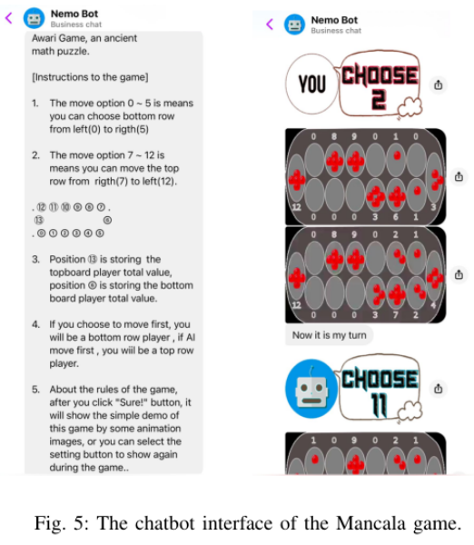

 -->

  <em>Example taken from paper <a href="https://arxiv.org/pdf/2604.21896">Nemobot Games</a> & <a href="https://pdfcoffee.com/atp-1-d-vol-i-pdf-free.html">ATP-1 NATO</a></em> 

<table style="width: 100%;">
  <tr>
    <th style="text-align: center; width: 50%;">Unstructured Layout</th>
    <th style="text-align: center; width: 50%;">Docling Layout</th>
  </tr>
  <tr>
    <td width="50%">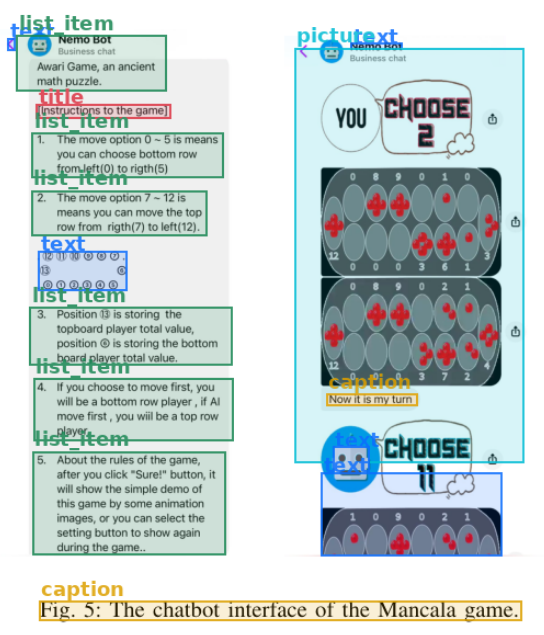</td>
    <td width="50%">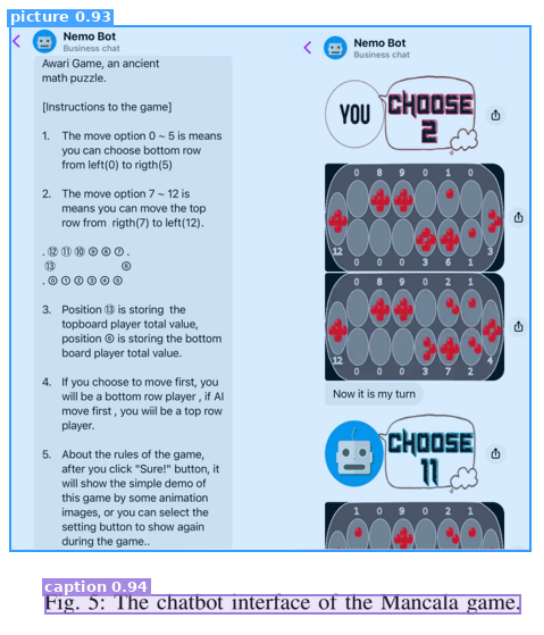</td>
  </tr>

  <tr>
    <td width="50%">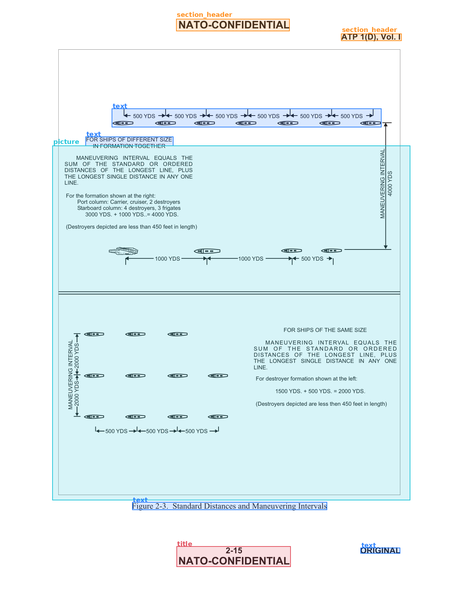</td>
    <td width="50%">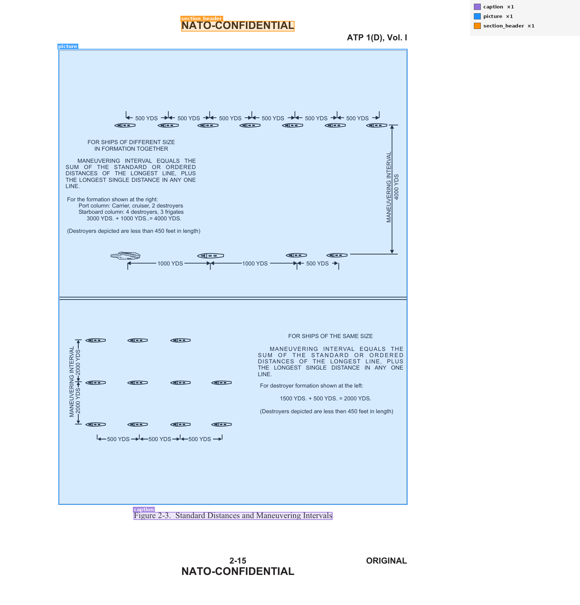</td>
  </tr>
  <tr>
    <td width="50%">Unstructured divided the picture into text regions</td>
    <td width="50%">Docling's robustness helps in preserving the full figure as one unit</td>
  </tr>

  <tr>
    <td width="50%">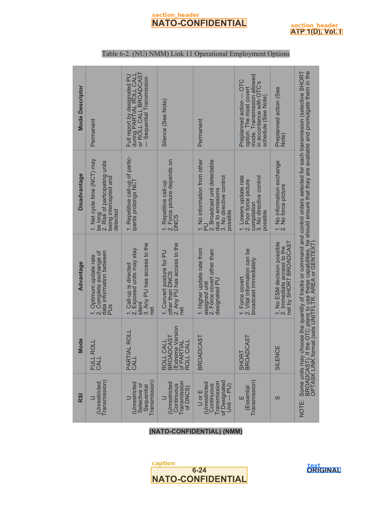</td>
    <td width="50%">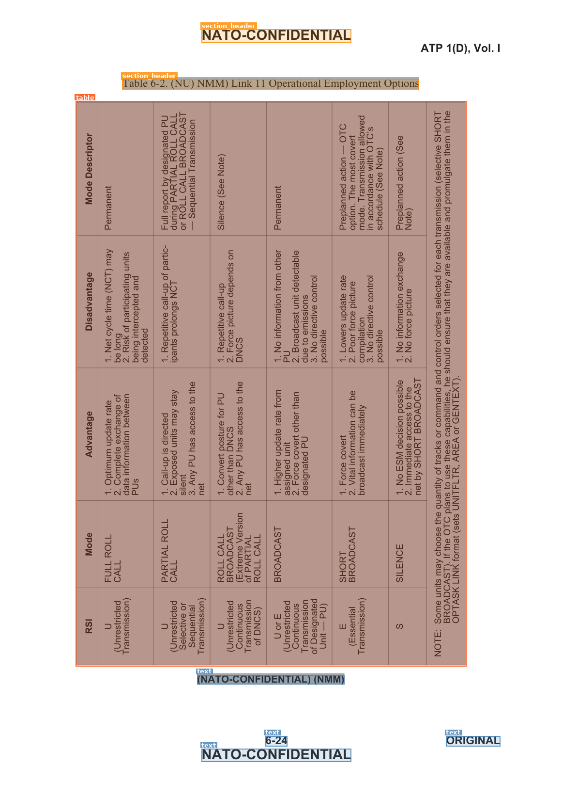</td>
  </tr>
  <tr>
    <td width="50%">Missed the Table as it is Inverted.</td>
    <td width="50%">Docling captures it well.</td>
  </tr>

  <tr>
    <td width="50%">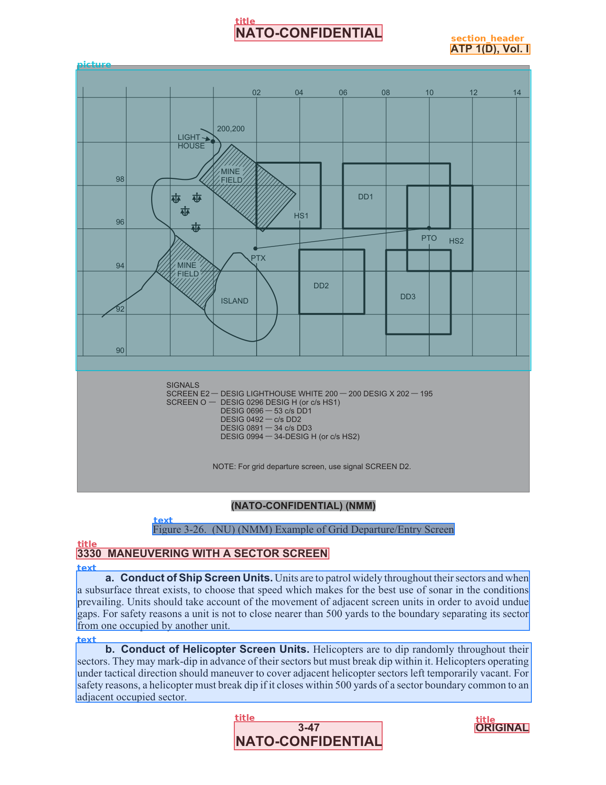</td>
    <td width="50%">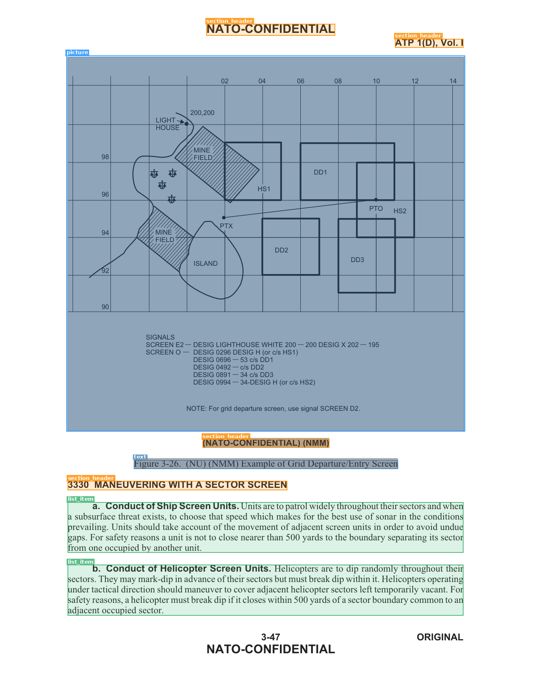</td>
  </tr>

  <tr>
    <td width="50%">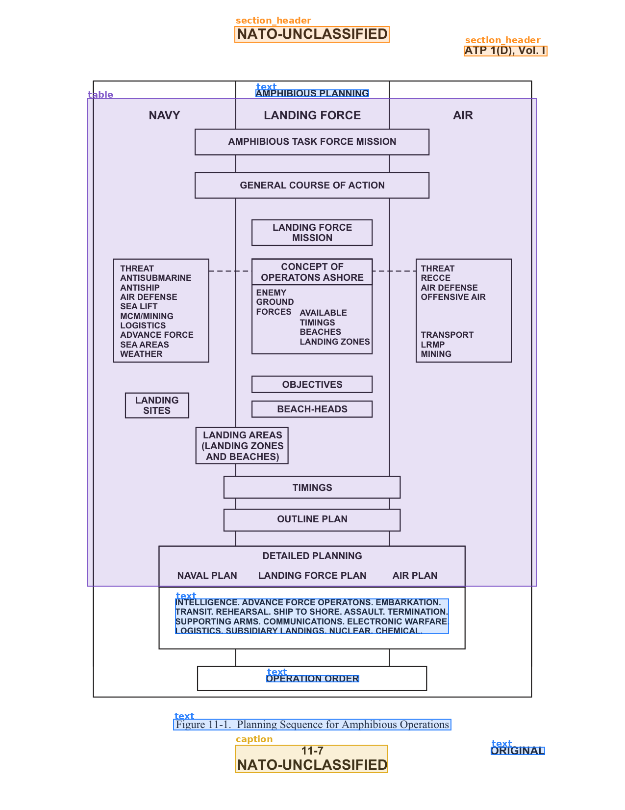</td>
    <td width="50%">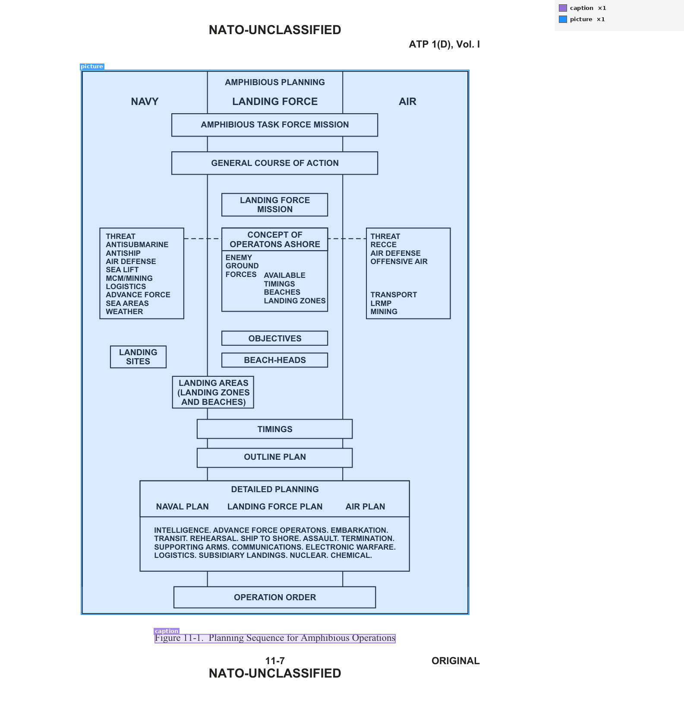</td>
  </tr>
  <tr>
    <td width="50%">Part of Figure is captured</td>
    <td width="50%">Docling Captures the full Figure</td>
  </tr>
  
</table>

---

## Equations

<!-- 

  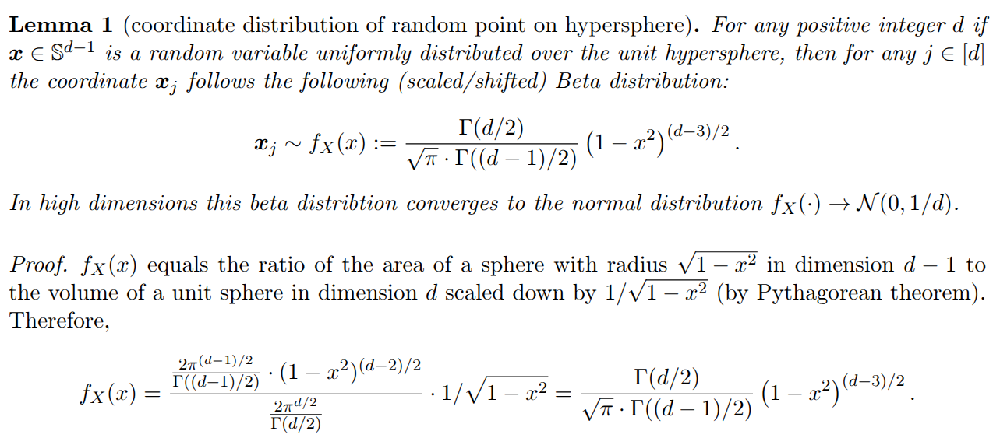

 -->

  <em>Example taken from paper <a href="https://arxiv.org/pdf/2504.19874">TurboQuant</a></em>

<table style="width: 100%;">
  <tr>
    <th style="text-align: center; width: 50%;">Unstructured Layout</th>
    <th style="text-align: center; width: 50%;">Docling Layout</th>
  </tr>
  <tr>
    <td width="50%">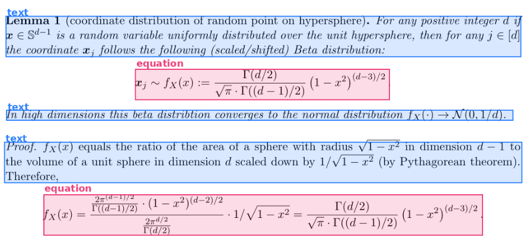</td>
    <td width="50%">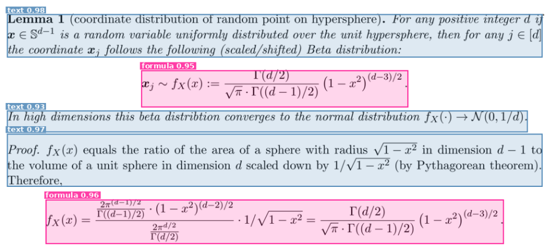</td>
  </tr>
  <tr>
    <td width="50%" markdown="1">

**Unstructured Output:**

Lemma 1 (coordinate distribution of random point on hypersphere). For any positive integer d if x € S&! is a random variable uniformly distributed over the unit hypersphere, then for any j € {d] the coordinate x; follows the following (scaled/shifted) Beta distribution:

$$_ ri), Vr -T((d—1)/2) x; ~ fx(x): 2) 3)?$$

In high dimensions this beta distribtion converges to the normal distribution fx(-) > N(0,1/d).

Proof. fx(a) equals the ratio of the area of a sphere with radius V1 — x? in dimension d— 1 to the volume of a unit sphere in dimension d scaled down by 1/V1— x? (by Pythagorean theorem). Therefore,

$$Qn (4-1)/2 (1— g?)(d-2)/2 eee. _ -P(d/2) fx(x) = Dea Uv l= ed) 2292$$

  </td>
    <td width="50%">

**Docling Output:**

Lemma 1 (coordinate distribution of random point on hypersphere) . For any positive integer d if x ∈ S d -1 is a random variable uniformly distributed over the unit hypersphere, then for any j ∈ [ d ] the coordinate x j follows the following (scaled/shifted) Beta distribution:

$$x_{j} \sim f_{X}(x) := \frac{\Gamma(d/2)}{\sqrt{\pi} \cdot \Gamma((d-1)/2)} \left(1 - x^{2}\right)^{(d-3)/2}$$

In high dimensions this beta distribtion converges to the normal distribution f X ( · ) →N (0 , 1 /d ) .

Proof. f X ( x ) equals the ratio of the area of a sphere with radius √ 1 -x 2 in dimension d -1 to the volume of a unit sphere in dimension d scaled down by 1 / √ 1 -x 2 (by Pythagorean theorem). Therefore,

$$f _ { X } ( x ) = \frac { \frac { 2 \pi ^ { ( d - 1 ) / 2 } } { \Gamma ( ( d - 1 ) / 2 ) } \cdot ( 1 - x ^ { 2 } ) ^ { ( d - 2 ) / 2 } } { \frac { 2 \pi ^ { d / 2 } } { \Gamma ( d / 2 ) } } \cdot 1 / \sqrt { 1 - x ^ { 2 } } = \frac { \Gamma ( d / 2 ) } { \sqrt { \pi } \cdot \Gamma ( ( d - 1 ) / 2 ) } \left ( 1 - x ^ { 2 } \right ) ^ { ( d - 3 ) / 2 } .$$

  </td>
  </tr>
  <tr>
    <td width="50%">Unstructured could not parse the equation as it renders equations from text only. (No specific Equation Recognition model is used)</td>
    <td width="50%">Docling uses a VLM model for equation recognition from image to text. <a href="https://huggingface.co/docling-project/CodeFormulaV2">CodeFormulaV2</a></td>
  </tr>
</table>

---

## Algorithm

<!-- 

  

 -->

  <em>Example taken from paper <a href="https://arxiv.org/pdf/2604.21896">Nemobot Games</a></em>

<table style="width: 100%;">
  <tr>
    <th style="text-align: center; width: 50%;">Unstructured Layout</th>
    <th style="text-align: center; width: 50%;">Docling Layout</th>
  </tr>
  <tr>
    <td width="50%">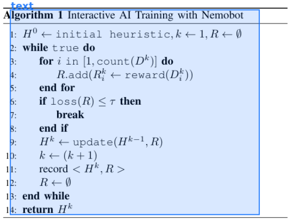</td>
    <td width="50%">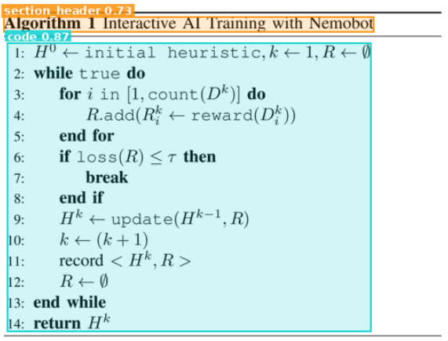</td>
  </tr>
  <tr>
    <td width="50%" markdown="1">

**Unstructured Output:**

Algorithm 1 Interactive AI Training with Nemobot 1: H+ initial heuristic,k+1,R<¢0 2: while true do 3 for i in [1, count(D*)] do 4: R.ada(R¥ + reward(D*)) 5: end for 6 if loss(R) <7 then 7 break 8 end if 9: H* — update(H*1, R) 10: k«+(k+1) 11: record < H*,R> 12: R+<9 13: end while 14: return H*

  </td>
<td width="50%" style="word-wrap: break-word; overflow-wrap: break-word;">

**Docling Output:**
## Algorithm 1 Interactive AI Training with Nemobot

1: H 0 ← initial heuristic , k ← 1 , R ←∅ 2: while true do 3: for i in [1 , count ( D k )] do 4: R. add ( R k i ← reward ( D k i )) 5: end for 6: if loss ( R ) ≤ τ then 7: break 8: end if 9: H k ← update ( H k -1 , R ) 10: k ← ( k +1) 11: record < H k , R > 12: R ←∅ 13: end while 14: return H k

</td>
  </tr>
  <tr>
    <td width="50%">Detected everything as Text. Misread the Symbols by Irregular Characters.</td>
    <td width="50%">Detceted both Text and code part, Proper recognisiton of Symbols/Letters . </td>
  </tr>
</table>

