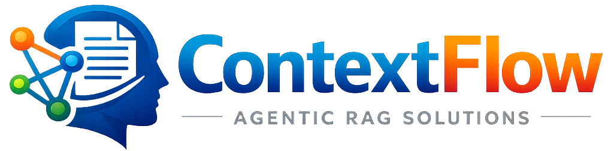
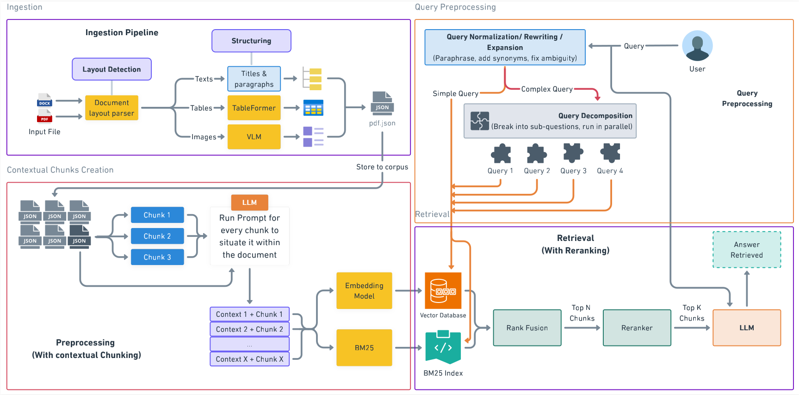

  

  <b>Context-aware Retrieval-Augmented Generation (RAG) Pipeline</b>

---

## 📌 Overview

**ContextFlow** is a modular RAG pipeline designed for intelligent document understanding, multimodal retrieval, metadata-aware chunking, and grounded response generation.

The pipeline supports:

- 📄 PDF ingestion & OCR
- 🧩 Semantic chunking
- 🖼️ Image/table/equation extraction
- 🔍 Hybrid retrieval
- 🧠 LLM-based answer generation
- 📦 Metadata & bounding-box tracking
- 🌐 UI-ready retrieval visualization

---

## 🖼️ RAG Pipeline

  

